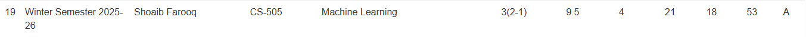

# "UAF-Sir-Shoab-ML"

> **Personal open repository** for Machine Learning notes and assignments prepared by me, based on **Sir Shoab’s lectures** at the University of Agriculture, Faisalabad (UAF).

---

---

---
## 📚 Project Overview

This repository contains **my self-prepared notes, assignments, and practice materials** for the Machine Learning course taught by Sir Shoab at UAF.  

The purpose of this repo is:
- To organize and preserve my own study materials.
- To share with friends and peers for better understanding.
- To make learning resources available for revision and collaborative study.

> **Note:** These are **self-made notes and solutions**, created for learning and sharing with classmates. All materials are intended for **educational purposes only**.

---

## 🚀 Why this repo exists

- Keep a personal record of my study progress in ML.
- Share notes and assignments with friends for group study.
- Encourage collaborative learning by letting others suggest improvements.

---

## ✅ How to use

- Open `Programing-Labs/` to review my python program notes.
- Open `PDF-Leactures/` to review any study related slides.
- Explore `assignments/` for practice problems and my solutions.
- Assets `images/` for the assets used in assignments
---

## 🙌 Contributing

Friends and peers are welcome to contribute!  
Ways to help:
1. **Point out mistakes** — report issues or suggest corrections.
2. **Improve notes** — clearer explanations, extra examples, or diagrams.
3. **Add code** — provide alternative solutions or improvements.
4. **Suggest resources** — share tutorials, papers, or references that complement lectures.

Guidelines:
- Fork the repo and create a branch for your changes.
- Open a Pull Request with a clear title and description.
- Respect academic honesty — do not upload others’ copyrighted material.

---

## 📬 Contact

This repository is maintained by me as part of my learning journey.  
If you are a UAF student or friend, feel free to use and share it for study purposes. 🙌

---

✨ Thank you for supporting open learning — together we grow stronger!

<b>For Quries Contact Me via <a href="https://www.linkedin.com/in/muhammad-hamid-raza-082aa62ba">Linkedin</a></b>

